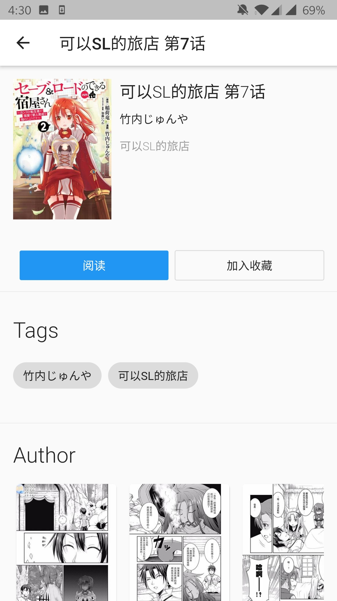

    Project Polaris | You Comic

    Project Polaris 是针对内容管理的开发项目，YouComic是其中的关于漫画内容管理的套件

 

 

## YouComic Mobile Suit
 
 
 

YouComic Mobile Suit是YouComic的针对移动设备开发的客户端，书籍阅读功能.

### ⚡Feature
- 📚浏览书籍列表
- 🔖查看标签
- ⭐️收藏夹
- 🔍搜索书籍和标签
- 📘阅读书籍
- 📱支持多平台

### 📷Preview

### 🔗链接
- [☁️YouComic Server](https://github.com/Project-XPolaris/YouComic-Server)
- [💻YouComic Studio](https://github.com/Project-XPolaris/YouComic-Studio)
- [🔨YouComic Supervisor](https://github.com/Project-XPolaris/YouComic-Supervisor)
- [⭐️Project Polaris](https://github.com/Project-XPolaris)